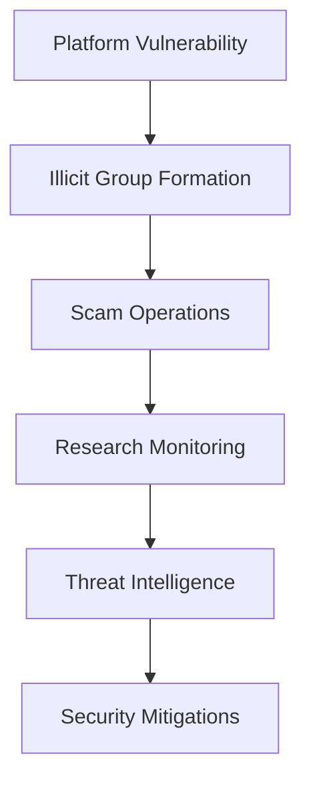

# Buy MDMA Online - Telegram Vendor Research 

 

## Telegram Vendors 

``` 

https://darkfail.net/?category=telegram 

``` 

 

## Understanding Encrypted Platform Vulnerabilities 

 

This educaitonal repository looks through cyber-security threats in encrypted communication apps like Telegram Darknet. It looks through risk patterns and provides mitigation strategies darknet researchers looking into darknet ecosystems. 

 

### Platform Threat Analysis 

 

Encrypted messaging services can harbor many illicit networks when abused by telegram plugs. Common vulnerabilities are: 

- **Un-verified vendor chains**: Accounts that are posing as "best telegram vendors" often operate without any validation 

- **Group infiltration risks**: Many shared telegram group link systems have enabled bad actor penetration 

- **Metadata leakages**: Even telegram dark web channels expose geolocation information 

- **Payment method interception**: Crypto-currency transactions that lack consumer protection systems 

 

### Monitoring Resources 

 

For researchers tracking looking into platform abuse patterns: 

- Telegram vendor report archive: 

[Telegram Vendors: https://darkfail.net/?category=telegram](https://darkfail.net/?category=telegram) 

- Threat intelligence feed (updated weekly) 

- Channel takedown monitoring dashboard by dark.fail 

 



 

### Protective Measures 

 

If studying "how to find telegram vendors" for academic research purposes: 

1. Always use virtual machines with secure VPN chains 

2. Never engage with suspected illicit operators 

3. Employ packet level encryption during observation 

5. Consult legal counsel before research 

 

### Key Terminology Guide 

| Term | Academic Definition | 

|------|---------------------| 

| Telegram plugs | Unverified supplier accounts on messaging platforms | 

| Darknet telegram | Encrypted channels operating outside standard indexing | 

| Vendor identification | Research process of mapping anonymous accounts | 

 

> **Ethical Notice**: This repository does not facilitate any prohibited activities. All terminology is presented in cybersecurity research context. Platform abuse reports should be directed to appropriate authorities as soon as found.

